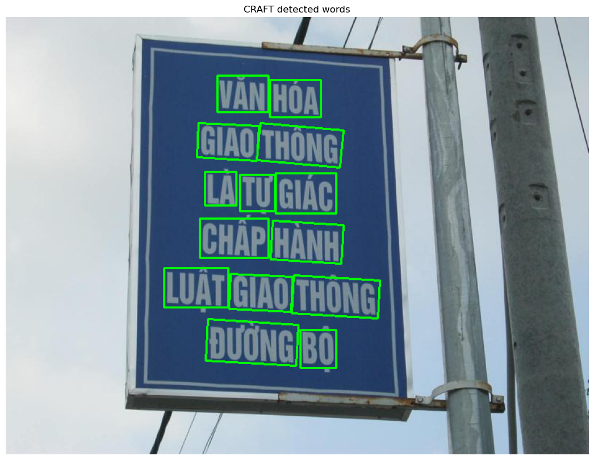
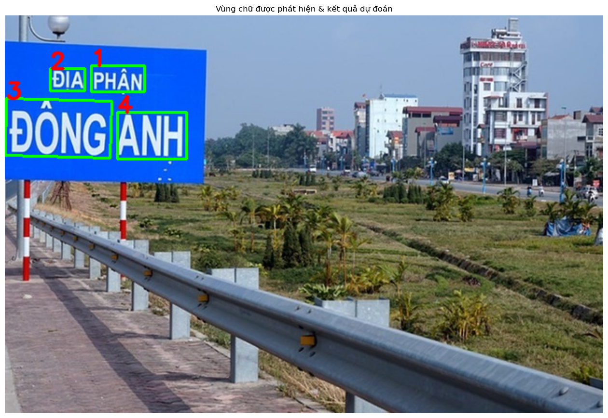

# Hệ Thống Nhận Dạng và Phát Hiện Văn Bản trong Ảnh

> Dự án cuối kì môn Học sâu

Dự án này xây dựng một hệ thống toàn diện để **phát hiện và nhận dạng văn bản** trong ảnh bằng các mô hình Deep Learning. Hệ thống kết hợp hai thành phần chính: **phát hiện vị trí văn bản** (Text Detection) và **nhận dạng nội dung văn bản** (Text Recognition).

## 📋 Mục Lục

- [Giới Thiệu](#giới-thiệu)
- [Cấu Trúc Dự Án](#cấu-trúc-dự-án)
- [Cài Đặt](#cài-đặt)
- [Dữ Liệu](#dữ-liệu)
- [Hướng Dẫn Sử Dụng](#hướng-dẫn-sử-dụng)
  - [Tiền Xử Lý Dữ Liệu](#tiền-xử-lý-dữ-liệu)
  - [Huấn Luyện Mô Hình](#huấn-luyện-mô-hình)
  - [Suy Luận (Inference)](#suy-luận-inference)
- [Hình Ảnh Minh Họa](#hình-ảnh-minh-họa)
- [Các Thành Phần Chính](#các-thành-phần-chính)
- [Kết Quả và Đánh Giá](#kết-quả-và-đánh-giá)

---

## Giới Thiệu

Hệ thống được thiết kế để xử lý hai tác vụ OCR cơ bản:

### 1. **Phát Hiện Văn Bản (Text Detection)**

- Sử dụng mô hình **CRAFT** (Character Region Awareness For Text detection)
- Sử dụng mô hình **DBNet** (Real-time Scene Text Detection with Differentiable Binarization)
- Xác định vị trí và ranh giới của văn bản trong ảnh
- Hỗ trợ phát hiện khu vực văn bản với độ chính xác cao

### 2. **Nhận Dạng Văn Bản (Text Recognition)**

- Xây dựng mô hình OCR tùy chỉnh sử dụng **CNN + RNN**
- Sử dụng các bộ dữ liệu:
  - **IIIT5K**: Tập dữ liệu tiếng Anh
  - **VIETOCR**: Tập dữ liệu tiếng Việt
  - **Dữ liệu tùy chỉnh**: Ảnh tiếng Việt xây dựng riêng
- Hỗ trợ nhận dạng văn bản đơn dòng
- Sử dụng Attention mechanism để cải thiện độ chính xác

---

## Cấu Trúc Dự Án

```
.
├── CRAFT/                      # Mô hình phát hiện văn bản CRAFT
│   └── craft_mlt_25k.pth      # Pre-trained model
│
├── DBNet/                      # Mô hình phát hiện văn bản DBNet
│
├── model/                      # Các mô hình đã huấn luyện
│   ├── ocr_model.pth          # Mô hình OCR chính
│   ├── text/                  # Từ vựng
│   │   └── vocab.json         # Character vocabulary
│   └── history/               # Lịch sử huấn luyện
│
├── data/                       # Dữ liệu
│   ├── IIIT5K/                # Dataset tiếng Anh
│   ├── VIETOCR/               # Dataset tiếng Việt
│   └── vietnamese/            # Dữ liệu tùy chỉnh
│
├── source/                     # Mã nguồn Jupyter Notebook
│   ├── DataPreprocessing.ipynb
│   ├── TrainingModel.ipynb
│   ├── Inference.ipynb
│   └── data_repair.ipynb
│
├── test_infer.ipynb            # Notebook inference hoàn chỉnh (CRAFT + OCR)
│
├── images/                     # Hình ảnh minh họa
│
└── README.md
```

---

## Cài Đặt

### Yêu Cầu Hệ Thống

- Python 3.7+
- PyTorch 1.4+ (với GPU CUDA 10.1+ nếu có sẵn)

### Bước Cài Đặt

1. **Cài đặt dependencies chính**

   ```bash
   pip install torch torchvision
   pip install numpy pandas opencv-python pillow
   pip install matplotlib scikit-learn tqdm
   pip install easyocr paddleocr
   ```

2. **Cấu hình môi trường** (tuỳ chọn)
   ```bash
   python -m venv venv
   source venv/Scripts/activate  # Trên Windows
   ```

---

## Dữ Liệu

### Các Tập Dữ Liệu Được Sử Dụng

| Tập Dữ Liệu            | Mô Tả                                       | Số Lượng | Ngôn Ngữ    |
| ---------------------- | ------------------------------------------- | -------- | ----------- |
| IIIT5K                 | Dữ liệu scene text tiếng Anh chất lượng cao | ~5,000   | Tiếng Anh   |
| VIETOCR                | Dữ liệu OCR tiếng Việt                      | Thay đổi | Tiếng Việt  |
| Vietnamese (Tùy chỉnh) | Ảnh tiếng Việt xây dựng riêng               | Thay đổi | Tiếng Việt  |
| COCO-Text              | Dữ liệu text detection lớn                  | -        | Đa ngôn ngữ |

### Định Dạng Dữ Liệu

**Cho Text Detection:**

```
./data/train/img/001.jpg    ./data/train/gt/001.txt
```

File groundtruth (.txt) có format:

```
x1, y1, x2, y2, x3, y3, x4, y4, annotation
```

**Cho Text Recognition:**

```csv
ImgName,GroundTruth,tokens,normalized,token_ids
image_001.jpg,hello,['h','e','l','l','o'],hello,[4,5,6,6,7]
```

---

## Hướng Dẫn Sử Dụng

### Tiền Xử Lý Dữ Liệu

Sử dụng notebook `source/DataPreprocessing.ipynb`:

**Các bước chính:**

1. **Chuẩn hóa văn bản** (normalize_text)
   - Chuyển Unicode về dạng NFC
   - Chuyển về chữ thường
   - Loại bỏ ký tự không cần thiết

2. **Tokenization**
   - Tách văn bản thành các ký tự
   - Xây dựng từ vựng (vocabulary)

3. **Tạo token IDs**
   - Chuyển ký tự thành số hiệu dựa trên từ vựng
   - Thêm các token đặc biệt: `<pad>`, `<sos>`, `<eos>`, `<unk>`

4. **Chia tập dữ liệu**
   - Chia thành train/validation/test sets

---

### Huấn Luyện Mô Hình

#### A. Huấn Luyện Mô Hình OCR (Text Recognition)

Sử dụng notebook `source/TrainingModel.ipynb`:

**Kiến trúc mô hình:**

```
Input Image (32x128)
    ↓
CNN Backbone (ResNet34) + Positional Encoding
    ↓
Feature Maps
    ↓
Transformer Decoder (Self-Attention & Cross-Attention)
    ↓
Output Sequence (Text)
```

**Hyper-parameters:**

```python
# Cấu hình huấn luyện
config = {
    'img_size': (32, 128),
    'max_len': 25,
    'hidden_dim': 256,
    'num_layers': 2,
    'dropout': 0.5,
    'lr': 1e-3,
    'batch_size': 64,
    'epochs': 100,
    'device': 'cuda'  # hoặc 'cpu'
}
```

**Chạy huấn luyện:**

```python
# Load dữ liệu
train_loader = DataLoader(train_dataset, batch_size=64, shuffle=True)
val_loader = DataLoader(val_dataset, batch_size=64)

# Khởi tạo mô hình
model = OCRModel(...)
optimizer = torch.optim.Adam(model.parameters(), lr=1e-3)
criterion = CrossEntropyLoss()

# Huấn luyện
for epoch in range(num_epochs):
    train_loss = train_epoch(model, train_loader, optimizer, criterion)
    val_loss = validate(model, val_loader, criterion)
    print(f"Epoch {epoch}: Train Loss={train_loss:.4f}, Val Loss={val_loss:.4f}")

# Lưu mô hình
torch.save(model.state_dict(), 'model/ocr_model.pth')
```

#### B. Huấn Luyện Mô Hình DBNet (Text Detection)

**Mô hình DBNet** được dùng để phát hiện vị trí văn bản trong ảnh. Để huấn luyện, hãy tham khảo hướng dẫn trong thư mục `DBNet/` của dự án.

---

### Suy Luận (Inference)

#### A. Phát Hiện Văn Bản với CRAFT

**Mô hình CRAFT** được dùng để phát hiện vị trí các ký tự và văn bản trong ảnh. Mô hình pre-trained có sẵn trong thư mục `CRAFT/` và có thể sử dụng trực tiếp cho suy luận.

#### B. Phát Hiện Văn Bản với DBNet

**Mô hình DBNet** là một mô hình phát hiện text khác cũng có thể sử dụng. Tham khảo thư mục `DBNet/` để biết cách chạy inference.

#### C. Nhận Dạng Văn Bản

Sử dụng notebook `source/Inference.ipynb` để thực hiện nhận dạng văn bản trên ảnh.

#### D. Inference End-to-End (CRAFT + OCR)

Notebook `test_infer.ipynb` là một giải pháp hoàn chỉnh kết hợp:

- **CRAFT**: Phát hiện vị trí văn bản trong ảnh
- **Transformer OCR**: Nhận dạng từng vùng text đã được phát hiện

**Các bước chính:**

1. Tải mô hình CRAFT pre-trained
2. Phát hiện các vùng chứa text trong ảnh
3. Cắt từng vùng text từ ảnh gốc
4. Sử dụng mô hình OCR để nhận dạng nội dung mỗi vùng
5. Hiển thị kết quả với bounding boxes và text đã nhận dạng

---

## Hình Ảnh Minh Họa

### Kết Quả Phát Hiện và nhận dạng văn bản 1


_Ví dụ kết quả phát hiện vị trí các vùng chứa text trong ảnh sử dụng mô hình CRAFT_

### Kết Quả Phát Hiện và nhận dạng văn bản 2


_Ví dụ kết quả nhận dạng nội dung văn bản từ các vùng được phát hiện_

---

## Các Thành Phần Chính

### 1. CRAFT (Character Region Awareness For Text detection)

- Mô hình phát hiện văn bản với độ chính xác cao
- Xử lý nhanh, hỗ trợ phát hiện text ở các hướng khác nhau

### 2. DBNet (Real-time Scene Text Detection with Differentiable Binarization)

- Mô hình phát hiện text thời gian thực
- Sử dụng phương pháp binarization có thể vi phân

### 3. OCR Model (Custom CNN-Transformer)

- **Kiến trúc**: Encoder (ResNet34) + Transformer Decoder (Multi-head Attention)
- **Hỗ trợ**: Tiếng Anh, Tiếng Việt
- **Input**: Ảnh word (32x128)
- **Output**: Chuỗi ký tự

---

## Kết Quả và Đánh Giá

### Metrics Sử Dụng

#### Text Detection:

- **Precision**: Tỉ lệ các detection đúng
- **Recall**: Tỉ lệ các text được phát hiện
- **F-score**: Điều hòa giữa precision và recall

#### Text Recognition:

- **Character Error Rate (CER)**: Tỉ lệ lỗi ở cấp ký tự
- **Word Error Rate (WER)**: Tỉ lệ lỗi ở cấp từ
- **Accuracy**: Tỉ lệ nhận dạng chính xác

---

## Lịch Sử Huấn Luyện

Các lịch sử huấn luyện được lưu trong thư mục `model/history/`:

- `train_losses.json`: Loss trong quá trình huấn luyện
- `fine_tune_train_loss.json`: Loss khi fine-tuning

---

## Các Tệp Quan Trọng

| Tệp                              | Mô Tả                                      |
| -------------------------------- | ------------------------------------------ |
| `test_infer.ipynb`               | Inference hoàn chỉnh (CRAFT + Transformer) |
| `source/DataPreprocessing.ipynb` | Tiền xử lý và chuẩn bị dữ liệu             |
| `source/TrainingModel.ipynb`     | Huấn luyện mô hình OCR chính               |
| `source/Inference.ipynb`         | Suy luận và test mô hình                   |
| `source/data_repair.ipynb`       | Sửa lỗi và làm sạch dữ liệu                |
| `model/ocr_model.pth`            | Mô hình OCR đã huấn luyện                  |
| `model/text/vocab.json`          | Từ vựng ký tự                              |

---

## Hướng Phát Triển Tương Lai

1. **Mở Rộng Ngôn Ngữ**: Hỗ trợ thêm các ngôn ngữ khác
2. **Phát Hiện Đa Hướng**: Cải thiện phát hiện text ở các góc khác nhau
3. **Tối Ưu Hóa Tốc Độ**: Tăng tốc độ xử lý với các model nhẹ hơn
4. **Đầu Ra Dạng Cấu Trúc**: Phân tích layout và cấu trúc tài liệu
5. **API Web Service**: Xây dựng API để sử dụng từ các ứng dụng khác

---

## Tài Liệu Tham Khảo

1. CRAFT Paper: https://arxiv.org/abs/1904.01941
2. DBNet Paper: https://arxiv.org/abs/1911.08947
3. EasyOCR: https://github.com/JaidedAI/EasyOCR
4. PaddleOCR: https://github.com/PaddlePaddle/PaddleOCR

---

## Giấy Phép

Dự án này được phát triển cho mục đích học tập. Vui lòng tham khảo giấy phép của các thành phần riêng lẻ (CRAFT, DBNet, EasyOCR, PaddleOCR).

---

## Liên Hệ và Hỗ Trợ

Nếu có câu hỏi hoặc vấn đề, vui lòng liên hệ hoặc mở issue trên repository.

**Ngày cập nhật**: 27/02/2026

---
